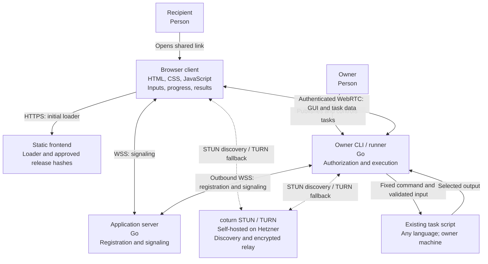

# Runlink architecture

Design target, not implemented. [VISION](../VISION.md) and [RATIONALE](../RATIONALE.md) define the product.

| View | Answers |
| --- | --- |
| This page | What runs where, which stack, and who owns state? |
| [Runtime](runtime.md) | How are tasks published, connected, and executed? |
| [Security](security.md) | What is trusted, verified, and isolated? |
| [Implementation](implementation.md) | What gets built first, and what remains unresolved? |

## Container view

[C4 container](https://c4model.com/diagrams/container) responsibilities in Mermaid; arrows show communication, not deployment permissions.

The owner serves the full GUI and executes tasks. The static loader connects the browser and verifies the GUI. WebRTC payload encryption terminates in browser and runner; HTTPS/WSS carries coordination. Direct connections avoid server payload bandwidth; TURN fallback incurs it.

## Stack

| Area | Choice | Reason |
| --- | --- | --- |
| CLI and application server | Go 1.27.1; one module, two executables; standard library first | Network I/O, process supervision, binary distribution |
| Browser | HTML, CSS, vanilla JavaScript; CLI embeds GUI with `go:embed` | Fixed task interaction; no frontend framework/runtime |
| Peer transport | Browser WebRTC and Pion WebRTC v4 in Go | Native encrypted data channels, NAT traversal, direct transfer |
| Signaling | HTTPS/WSS; `net/http` and `coder/websocket` | Small control messages; owner requires no inbound port forwarding |
| Process execution | `os/exec`, explicit arguments, process-group supervision | Reuse existing scripts and their installed environment |
| Initial storage | Local files; single application-server instance | Small registry and owner-local state; no external database or queue initially |
| Hosting | Self-hosted Linux VMs on Hetzner Cloud | Small first deployment; increase capacity when measured load requires it |
| STUN / TURN | Self-hosted [coturn](https://github.com/coturn/coturn) on Hetzner | Own discovery and relay infrastructure; standard WebRTC compatibility |

Pin dependencies at bootstrap.

First-release owner platforms are macOS and Linux. Windows is deferred to reach a working product sooner.

The owner CLI command is `runlink`. Users may configure `rl` as a shell alias; documentation and scripts use `runlink`.

Hetzner Cloud is the confirmed hosting provider for v1. We self-host the frontend, application server, and coturn in one location; [Security](security.md#first-version-hosting) defines placement and networking. Start with small VMs and scale within Hetzner as measured load requires.

## State ownership

| Location | State |
| --- | --- |
| Owner machine | Owner credential, task definitions, generated link secrets, access policy, run records, bounded result files |
| Application server | Durable UUID-to-owner registry with atomic reservation; active signaling connections in memory |
| Static frontend | Immutable loader releases and approved GUI hashes; no task data or secrets |
| Browser | Current session secret and task data in memory; no secret in telemetry or persistent web storage |
| TURN | Bounded relay allocations and transport metadata; no task plaintext |

One public domain: `runlink.dev`. Loader and application server run on separate servers; [Security](security.md) defines routing and permissions.

Browser-only recipients; one owner binary; no SDK or per-language discovery. Cloud execution, bespoke task interfaces, and multi-step recipient workflows are out of scope.
