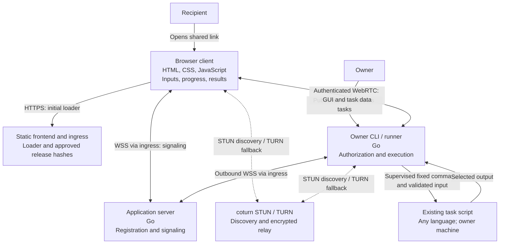

# Runlink architecture

Design target, not implemented. [VISION](../VISION.md) and [RATIONALE](../RATIONALE.md) define the product: `optional input -> task function -> output`, with execution on the owner's machine.

## Documentation structure

| Document | Purpose |
| --- | --- |
| This overview | Components, state ownership, and the main runtime flow |
| [Architecture decision records](#architecture-decision-records) | Accepted decisions, their context, and consequences |
| [Implementation plan](implementation.md) | Build order, required proofs, and unresolved implementation choices |

Decisions live in `adr/NNNN-short-title.md`, using Status, Context, Decision, and Consequences, following the [lightweight ADR format](https://cognitect.com/blog/2011/11/15/documenting-architecture-decisions). Accepted means agreed design, not completed implementation. New decisions use the next number; changed decisions get a new ADR that links to and supersedes the old one. Keep implementation progress in the plan.

## Architecture decision records

| ADR | Decision | Status |
| --- | --- | --- |
| [0001](adr/0001-owner-local-tasks.md) | Owner-local tasks and a single owner binary | Accepted |
| [0002](adr/0002-webrtc-transport.md) | WebRTC data channels with signaling and TURN fallback | Accepted |
| [0003](adr/0003-trusted-browser-client.md) | Trusted browser code and client-held recipient secrets | Accepted |
| [0004](adr/0004-bounded-task-registry.md) | Durable, bounded UUID registration | Accepted |
| [0005](adr/0005-run-recovery-and-supervision.md) | Durable run recovery and crash-surviving supervision | Accepted |
| [0006](adr/0006-hetzner-deployment.md) | Separate frontend, application, and TURN servers on Hetzner | Accepted |

## Container view

Arrows show communication, not deployment permissions.



The owner serves the full GUI and executes tasks. The static loader connects the browser and verifies the GUI. WebRTC payload encryption terminates in browser and runner; HTTPS/WSS carries coordination. Direct connections avoid server payload bandwidth; TURN fallback incurs it.

## State ownership

| Location | State |
| --- | --- |
| Owner machine | Owner credential, task definitions, generated link secrets, access policy, durable run and supervision records, bounded results |
| Application server | Bounded durable UUID-to-owner registry; active signaling connections in memory |
| Static frontend | Immutable loader releases and approved GUI hashes; no task data or secrets |
| Browser | Session secret and task data in memory; nonsecret task/run recovery handles in persistent browser storage |
| TURN | Bounded relay allocations and transport metadata; no task plaintext |

Browser persistence grants no access. Recovery always requires fresh authentication after a reload. URL cleanup reduces fragment exposure but cannot erase copies already recorded by browser history or synchronization; [ADR 0003](adr/0003-trusted-browser-client.md#recipient-secrets) defines that limitation.

## Publish, connect, run

```mermaid
sequenceDiagram
    actor O as Owner
    participant R as Local runner
    participant A as Application server
    actor U as Recipient
    participant B as Browser
    participant F as Static frontend

    O->>R: Publish fixed task and exposure policy
    R->>A: Authenticate owner and register within quota
    A-->>R: Durably reserved UUID
    R->>R: Generate and retain random secret locally
    R-->>O: URL with fragment, or URL plus separate secret
    O-->>U: Share selected format outside Runlink
    U->>B: Open shared URL
    B->>F: GET /UUID (fragment excluded)
    F-->>B: Static loader and approved GUI hashes
    B->>B: Capture fragment in memory and immediately remove it
    opt No secret in memory
        U->>B: Enter separately received secret or reopen original link
    end
    B->>A: Request connection for UUID
    A->>R: Forward offer and ICE candidates
    R-->>A: Answer and ICE candidates
    A-->>B: Forward response; close signaling when exchange ends
    Note over B,R: ICE selects direct path or TURN fallback
    B->>R: Mutually authenticate, bound to task and peers
    R-->>B: Official GUI bundle and task definition
    B->>B: Verify release hash before executing GUI
    alt Saved recovery handle exists
        B->>R: Query saved run ID; do not submit a new run
        R-->>B: Existing state or explicit unknown/expired outcome
    else Recipient explicitly starts a run
        B->>B: Persist nonsecret task/run handle before sending
        B->>R: Run ID and complete input
        R->>R: Authorize, validate, persist acceptance, deduplicate
        R-->>B: Accepted acknowledgment
        R->>R: Start under independent supervision and limits
    end
    R-->>B: Exposed progress, resource usage, and result when available
    B-->>R: Result receipt acknowledgment
```

GUI and task data flow only after authentication. Scripts need no cryptographic integration. [ADR 0005](adr/0005-run-recovery-and-supervision.md) defines recovery when delivery or execution is uncertain.
