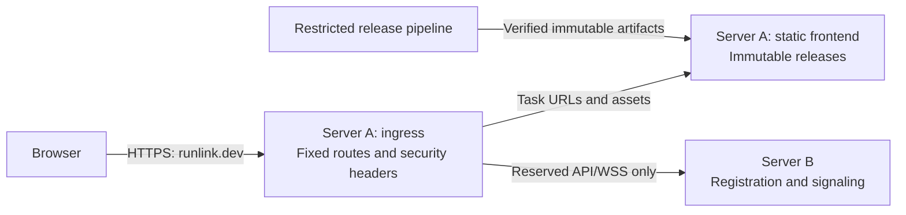

# ADR 0006: Separate frontend, application, and TURN servers on Hetzner

## Status

Accepted. Recorded 2026-10-02.

## Context

The first deployment needs independent control of executable browser code, signaling, and relay traffic. Hetzner Cloud is the settled v1 provider. Start in one location and increase capacity when measured load requires it.

## Decision

Self-host three Linux VMs:

| Server | Responsibility |
| --- | --- |
| A: frontend and ingress | Immutable loader and approved hashes; HTTPS termination; fixed API/WSS forwarding with the independent controls in [ADR 0003](0003-trusted-browser-client.md#ingress-and-executable-content) |
| B: application server | Registration, bounded durable UUID registry, and signaling; no write access to A or release credentials |
| C: coturn | STUN discovery and encrypted TURN relay; directly reachable public IPv4 and IPv6 |

Keep task URLs under `https://runlink.dev/{uuid}`. TURN is a separate transport endpoint, not an HTTP route. Finalize endpoint addressing, certificates, and required UDP/TCP listeners and a bounded relay-port range in the connectivity proof.

B issues short-lived TURN credentials using coturn's [TURN REST authentication](https://github.com/coturn/coturn/wiki/turnserver#turn-rest-api). Keep the shared signing secret only on B and C. Deliver client credentials over HTTPS/WSS during setup; they permit relay use only and are separate from owner credentials and recipient secrets. Bound credential issuance, allocations, and bandwidth.

### TURN destination policy

Deny relay access to private, loopback, link-local, multicast, and infrastructure management/listener destinations, including A, B, and C's control services. Explicitly permit peers at C's public relay addresses within its configured relay-port range so two allocations on C can communicate. Do not blanket-deny C's public address or broadly exempt all its ports.

Enforce the address/port distinction with coturn policy and host firewall rules, including traffic delivered locally on C. Coturn's [peer allow/deny lists](https://github.com/coturn/coturn/blob/master/examples/etc/turnserver.conf) operate on IP ranges and are not a port boundary. Prove that both peers can use C simultaneously with direct paths disabled and each client restricted to TURN TCP/TLS, while relay attempts to management and listener ports still fail. Client-to-TURN TCP/TLS does not remove the need for relay-to-relay traffic.

### Operations

Maintain OS/coturn updates, TLS renewal, registry backups and recovery, availability monitoring, and relay traffic/cost alerts. Start with small VMs and one application-server instance; resize or add TURN capacity after measurement. Application-server replication needs a separate decision.

Hetzner offers [public IPs](https://docs.hetzner.com/cloud/servers/faq/) and [UDP/TCP firewall rules](https://docs.hetzner.com/cloud/firewalls/faq/). Its [load balancers support TCP/HTTP/HTTPS, not UDP](https://docs.hetzner.com/networking/load-balancers/faq/), so TURN uses C's public IP directly. Use host firewall rules for private-network isolation; Hetzner Cloud Firewalls do not filter private-network traffic.

## Consequences

We operate the servers and relay capacity. [Bandwidth is not guaranteed](https://docs.hetzner.com/cloud/technical-details/faq/), and [outgoing traffic beyond the included allowance is billed](https://docs.hetzner.com/cloud/billing/faq/); measure throughput and cost before scaling. Separate servers limit compromise paths but do not remove the trusted frontend or endpoint risks in [ADR 0003](0003-trusted-browser-client.md#consequences).
