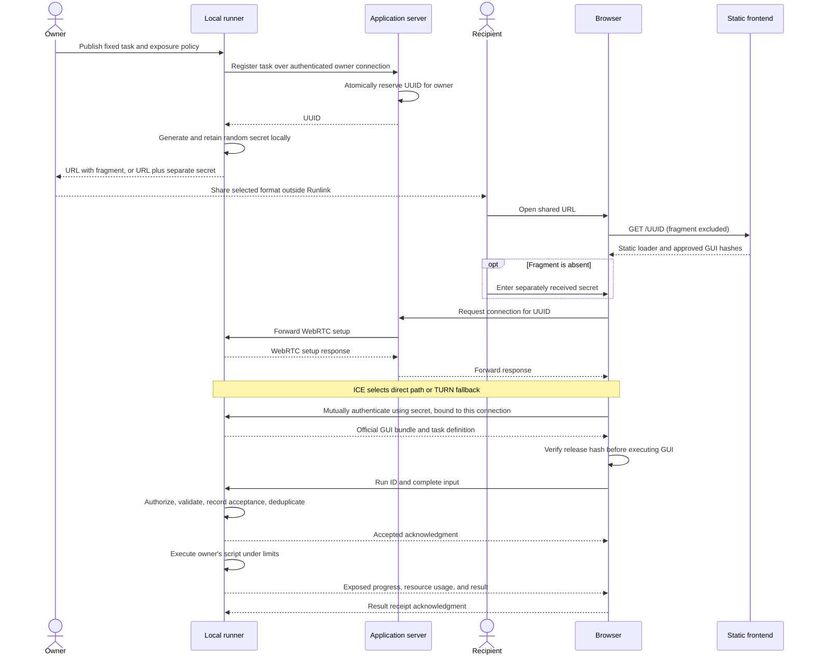

# Runtime

[Architecture](README.md) | [Security](security.md) | [Implementation](implementation.md)

## Publish, connect, run

GUI and task data flow only after authentication. The runner decrypts script inputs and encrypts exposed outputs; scripts need no cryptographic integration. The authentication protocol remains open.

The application server routes the UUID and exchanges initial offers, answers, and ICE candidates. Close the browser's signaling connection as soon as that initial exchange is complete; do not wait for the data channel to open or mutual authentication to finish. Peer connectivity checks, DTLS, channel establishment, and secret-based authentication proceed without the application server and may overlap candidate exchange. GUI transfer, task commands, results, and local access checks also require no application-server connection. The owner retains one registration/signaling connection to accept new recipients. Reopen browser signaling for a new connection or recovery requiring fresh ICE negotiation; TURN remains a dependency when a relay path is selected.

## Sharing contract

| Mode | Owner sends | Recipient does |
| --- | --- | --- |
| One-click | `https://runlink.dev/{uuid}#{secret}` | Opens link |
| Separate secret | `https://runlink.dev/{uuid}` and the same generated secret separately | Opens link and enters secret in the loader's password field |

The CLI generates a 256-bit random secret. Password entry changes delivery only, not secret generation. UUID routes; secret authorizes; a separate owner credential protects registration and reconnection.

## Task contract

Share no-input commands directly. Parameterized tasks use `task.json`; [exact syntax remains open](implementation.md#open-items).

| Owner declares | Runner enforces |
| --- | --- |
| Fixed executable, arguments, working directory | Launch only that command; no shell interpolation of recipient input |
| Typed fields mapped to arguments or JSON stdin | Validate values, sizes, and allowed argument/path semantics |
| Public outputs and metadata | Return only declared text/JSON, files, progress, and resource usage; diagnostics private by default |
| Execution policy | Deadlines, bounded input/output, rate limits, default one concurrent run per task |
| Access policy | Expiry and revocation checked locally on every invocation and result request |

Owners can stop running tasks locally. Cancellation terminates the supervised process group, without rolling back external side effects. First release supports trusted scripts, not detached daemons or hostile-code sandboxing.

## Delivery and failure semantics

Reliable, ordered channels have no retransmission-count or message-lifetime limit. They recover packet loss, not permanent disconnection. [Specification](https://www.w3.org/TR/webrtc/#rtcdatachannel)

| Event | Required behavior |
| --- | --- |
| Submit | Persist acceptance before acknowledgment/execution; reject the same run ID with different input |
| Duplicate submission | Return existing run state without executing again |
| Browser or network disconnect | Show unconfirmed/disconnected. Runner continues within limits; reconnect queries the same run ID |
| Runner crashes during execution | Recover as interrupted/unknown; never automatically repeat possible side effects |
| Result/file transfer | Bounded buffers/storage/retention; verify complete length and digest. Retry transfer without rerunning the task |
| Expire or revoke | Deny new runs and data access, including existing sessions. Owner separately controls stopping active runs; downloaded data cannot be recalled |
| Owner offline | Report unavailable; do not queue future execution |
| Application server restarts | Established peer sessions continue. Restore UUID ownership, reauthenticate owners, and rebuild routing for new connections and recovery |

Transport receipt, run acceptance, and completion are distinct. Exactly-once external side effects are not promised.
