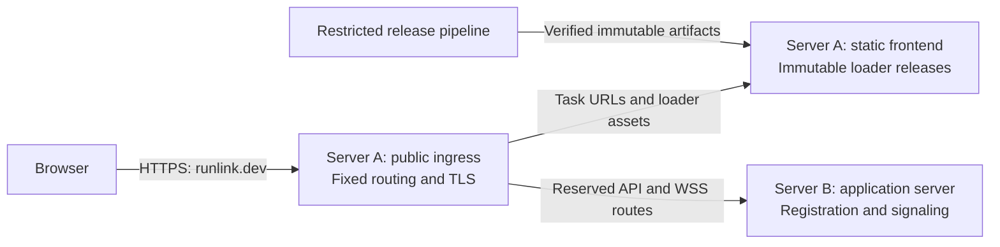

# Security and deployment

[Architecture](README.md) | [Runtime](runtime.md) | [Implementation](implementation.md)

## Separate servers, one domain

Task URLs return the static loader; API/WSS routes return typed control data. Server B has no permission to modify loader files, approved hashes, frontend policies, or ingress routing. Runtime identities cannot publish releases. Static hosting and release credentials are separate.

## First-version hosting

Self-host the infrastructure on three Linux VMs in one Hetzner Cloud location:

| Server | Responsibility |
| --- | --- |
| A: frontend and ingress | Immutable loader and approved hashes; HTTPS termination and fixed API/WSS forwarding to B |
| B: application server | Registration, durable UUID registry, and signaling; no write access to A |
| C: coturn | STUN discovery and encrypted TURN relay; directly reachable public IPv4 and IPv6 |

Keep task URLs under `runlink.dev/{uuid}`. TURN endpoint addressing, certificates, and exact listener/relay ports remain part of the public connectivity proof; TURN is a separate transport endpoint, not an HTTP route. Open only the required UDP/TCP listener and bounded relay-port range. Verify UDP and TCP/TLS fallback on representative networks, including restrictive ones.

The application server issues short-lived TURN credentials using coturn's [TURN REST authentication](https://github.com/coturn/coturn/wiki/turnserver#turn-rest-api). Keep the shared signing secret only on B and C. Client credentials are delivered over HTTPS/WSS during setup, permit relay use only, and are separate from owner credentials and runlink secrets. Bound credential issuance, allocations, and bandwidth; deny relay access to private, loopback, and infrastructure addresses.

We maintain OS/coturn updates, TLS renewal, backups and recovery for the registry, availability monitoring, and relay traffic/cost alerts. Start with small VMs and one application-server instance; resize or add TURN capacity after measurement. Adding application-server replicas requires a separate registry/signaling design.

Hetzner covers this deployment through [public IPs](https://docs.hetzner.com/cloud/servers/faq/) and [UDP/TCP firewall rules](https://docs.hetzner.com/cloud/firewalls/faq/). Its [load balancers support TCP/HTTP/HTTPS, not UDP](https://docs.hetzner.com/networking/load-balancers/faq/), so TURN uses C's public IP directly. [Cloud bandwidth is not guaranteed](https://docs.hetzner.com/cloud/technical-details/faq/), and [outgoing traffic beyond the included allowance is billed](https://docs.hetzner.com/cloud/billing/faq/); measure relay throughput and costs before increasing capacity. Use host firewall rules for private-network isolation; Hetzner Cloud Firewalls do not filter private-network traffic.

## Trust boundaries

| Boundary | Guarantee / limitation |
| --- | --- |
| Signaling or TURN compromised | Connection-bound authentication prevents invocation/decryption from UUID and setup traffic. Denial of service and routing/timing/traffic metadata remain exposed |
| Link shared | Anyone with the complete secret-bearing link has its permissions; separate delivery reduces exposure from a URL-only leak |
| Owner supplies GUI | Loader executes only an approved release bundle; owner definitions and output are untrusted data, not executable UI |
| Frontend hosting, ingress, or release system compromised | Attacker may replace the loader and steal secrets. Server separation reduces risk, not initial-code trust |
| Owner machine or recipient browser compromised | Endpoint plaintext and credentials may be exposed; E2E does not protect a compromised endpoint |
| Owner script executes | Existing owner environment; restrict inputs/actions and credential scope. No general sandbox claim |

## Authentication and secret handling

- Generate recipient secrets only in the CLI. Fragments are absent from ordinary HTTP requests; password-field entry remains browser-local.
- Use reviewed authentication binding secret possession to the task and actual WebRTC peers, with freshness/replay protection. Never send the secret over an unauthenticated connection.
- Require mutual authentication before task-data access. Owner credentials, recipient secrets, and session keys have distinct roles.
- Exclude owner credentials, runlink secrets, and session keys from forwarded signaling, telemetry, logs, and persistent browser storage. Validate messages; bound sizes, connections, and relay allocations.
- Enforce expiry, revocation, and execution limits locally.

## GUI verification and code protection

| Layer | Planned control |
| --- | --- |
| Release approval | Review/test a self-contained GUI bundle. Embed its SHA-256 hash in the trusted loader's approved list and its bytes in the CLI; cover all executable assets |
| Before execution | Verify the received bundle against loader-approved hashes. Reject unknown, altered, or withdrawn versions before execution; never take expected hashes from the owner |
| Browser execution | Strict hash-based CSP, no `eval` or arbitrary inline scripts, safe DOM APIs, and Trusted Types where supported. No analytics, tag managers, or third-party runtime scripts |
| Untrusted content | Render descriptions/results as validated data; active files as downloads. No arbitrary owner HTML/JS in the shared origin |
| Build and deployment | Minimal pinned dependencies, vulnerability checks, reviewed CI, signed immutable artifacts verified by deployment, separate release credentials, hardware-key-protected maintainer accounts |
| Verification | Test malicious bundles/output, cross-task access, replay, revocation, and signaling substitution. Obtain independent review of authentication before public launch |

UUID paths share one origin; they provide no isolation. Owners supply GUI bytes, but executable code must match an approved release. Hashes identify bytes, not absence of bugs.

The loader is the initial trusted code. CSP, hashes, signatures, and reproducible builds cannot protect against replacement of both page and verifier. Recipients need no extension, key management, or per-invocation owner approval.

References: [URL fragments](https://www.rfc-editor.org/rfc/rfc3986.html#section-3.5), [WebRTC authentication](https://www.rfc-editor.org/rfc/rfc8827.html#section-9.1), [browser origins](https://html.spec.whatwg.org/multipage/browsers.html#concept-origin), [CSP](https://www.w3.org/TR/CSP3/), [Trusted Types](https://www.w3.org/TR/trusted-types/), [SRI trust model](https://www.w3.org/TR/sri/).
